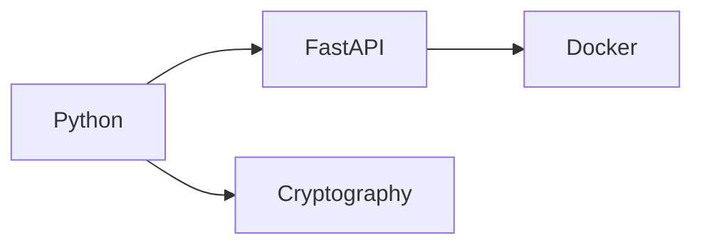

# 🔗 Blockchain Data Integrity Verifier


## 🌟 Live Demo
`https://your-app.fly.dev`

## 🚀 Features
- File hashing with SHA-256
- Tamper-proof verification
- Blockchain-style audit trail
- Chain validation endpoint
- Production-ready Docker setup

## 🛠️ Tech Stack


## Installation

### Local Development

1. Clone the repository
2. Install dependencies:
   ```
   pip install -r requirements.txt
   ```
3. Run the application:
   ```
   uvicorn main:app --reload
   ```

### Using Docker

1. Build the Docker image:
   ```
   docker build -t blockchain-verifier .
   ```
2. Run the container:
   ```
   docker run -p 8000:8000 blockchain-verifier
   ```

### Using Docker Compose

1. Start the application with Docker Compose:
   ```
   docker-compose up -d
   ```
2. View logs:
   ```
   docker-compose logs -f
   ```

### Environment Variables

The application supports the following environment variables:

| Variable | Description | Default |
|----------|-------------|--------|
| `PORT` | Port to run the application on | `8000` |
| `MAX_FILE_SIZE` | Maximum file size in MB | `10` |
| `RATE_LIMIT` | Rate limit per minute | `5` |
| `WORKERS` | Number of Gunicorn workers | `2` |
| `TIMEOUT` | Request timeout in seconds | `120` |
| `READ_ONLY_FS` | Enable read-only filesystem | `true` |

Example:
```
docker run -p 8000:8000 -e MAX_FILE_SIZE=20 -e RATE_LIMIT=10 blockchain-verifier
```

### Production Deployment

For production deployment instructions, see [DEPLOYMENT.md](DEPLOYMENT.md).

## API Endpoints

- `GET /`: Welcome message
- `POST /verify/hash`: Verify if a hash matches the provided data
- `POST /verify/transaction`: Verify a blockchain transaction from a JSON file
- `POST /verify/merkle-proof`: Verify a Merkle proof for data inclusion in a blockchain
- `POST /verify/file-hash`: Calculate SHA-256 hash of an uploaded file and optionally verify against expected hash
- `POST /hash`: Calculate SHA-256 hash of an uploaded file (max 10MB) and add it to the blockchain audit log
- `POST /verify`: Verify file integrity by comparing current hash with stored hash (includes blockchain audit logging)
- `GET /blockchain-log`: Retrieve the complete blockchain audit log (sorted by index, includes chain validity status)
- `GET /validate-chain`: Validate the blockchain integrity (verifies hash chain, block sequence, and timestamps)

## Utility Functions

- `calculate_file_hash(file_bytes: bytes) -> str`: Memory-efficient function that calculates SHA-256 hash of input bytes in 64KB chunks
- `calculate_block_header_hash(block: dict) -> str`: Calculates SHA-256 hash of a block header (index + previous_hash + timestamp + operation + filename + result)
- `create_genesis_block() -> dict`: Creates the initial genesis block for the blockchain
- `validate_blockchain() -> Tuple[bool, Optional[int]]`: Validates the entire blockchain for integrity, returns validity status and index of first invalid block (if any)

## API Documentation

Once the application is running, you can access the interactive API documentation at:

- Swagger UI: http://localhost:8000/docs
- ReDoc: http://localhost:8000/redoc